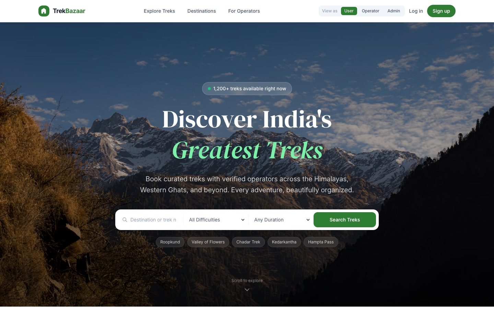
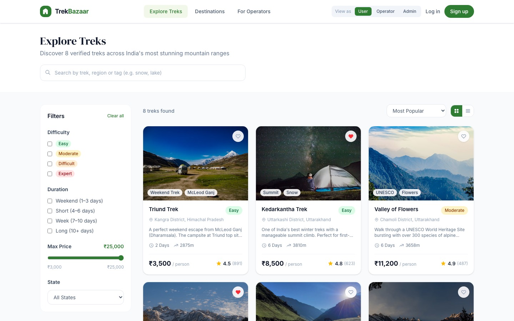
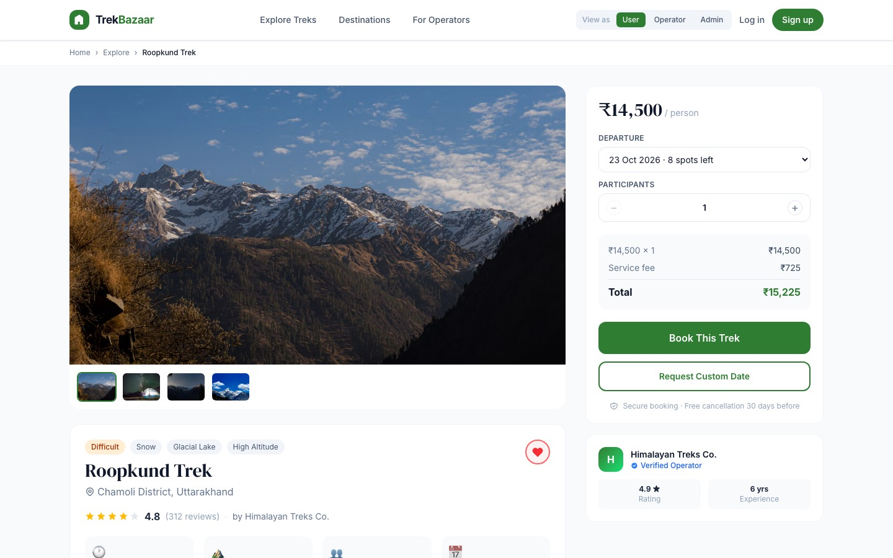
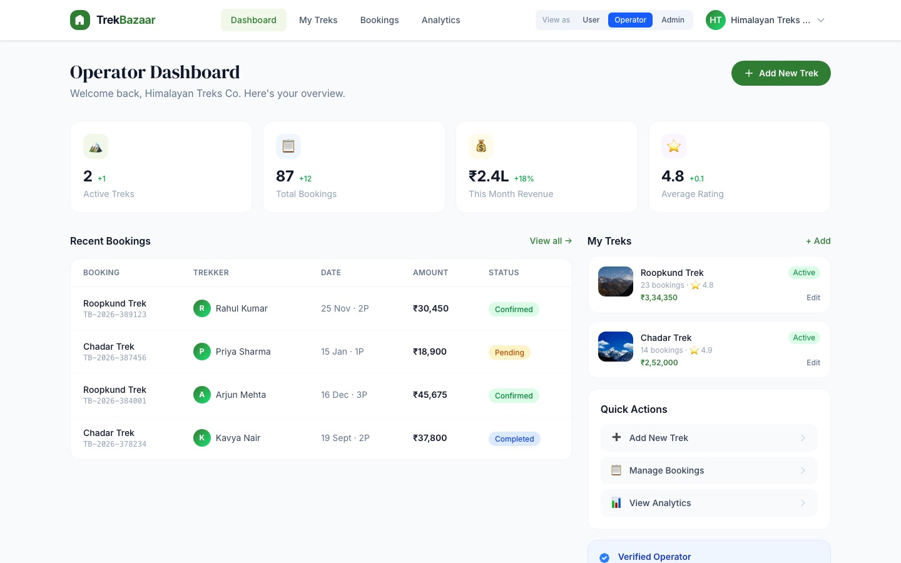

# TrekBazaar

A frontend for a trekking marketplace for Indian treks. Trekkers can browse, filter, wishlist and book treks. Operators can publish and manage listings. Admins can moderate users, operators and reviews.

It started as a Figma Make UI/UX export (19 static screens). This repo turns that export into a runnable app: it adds URL routing, shared state that survives a reload, form validation, and working versions of the buttons that did nothing in the design.

> **This is a frontend demo with no backend.** Data lives in `localStorage` in your browser. Login accepts any email and password. Checkout takes no payment. Messages, emails and SMS are simulated with on-screen notices.



| Explore | Trek details | Operator dashboard |
|---|---|---|
|  |  |  |

## What works

**Trekkers**
- Search from the landing page, or use the quick tags and destination tiles. All of them open Explore pre-filtered.
- On Explore, filter by text, difficulty, duration, maximum price and state. Sort the results, and switch between grid and list views.
- The trek page has a gallery, tabs (overview, itinerary, inclusions, reviews), a departure picker and a live price breakdown.
- Booking is a three-step flow: choose a batch, enter traveller details, then pay by card, UPI or net banking. Each step is validated. The booking is saved and appears on the dashboard and in My Bookings.
- The confirmation page shows the real booking. You can download a receipt as a `.txt` file.
- My Bookings has status filters, and you can cancel a booking (with a confirm step).
- The wishlist is shared across every screen and kept after a reload.
- Settings: edit your profile and preview a photo; password validation; notification and 2FA toggles; region preferences; appearance / dark mode toggle; a reset for the demo data.

**Design & Theme Enhancements**
- **Dark Mode**: Complete system-wide dark mode support with automatic system preference detection (`prefers-color-scheme`), quick toggle in the top navigation bar, mobile menu switcher, and settings preference option. Preference is persisted in `localStorage`.
- **Refined Micro-Interactions**: Smooth card hover elevation lifts (`hover:-translate-y-1 hover:shadow-xl`), active button feedback animations, polished search controls, and customized scrollbar aesthetics.
- **Accessible Contrast**: High-contrast dark theme tokens tailored for optimal readability across all 19 screens, form controls, tables, badges, and modals.

**Operators**
- Add or edit a trek, with per-field validation. A published trek appears on Explore right away and can be booked.
- Booking management: search, status filters, and confirming pending bookings. Bookings you make as a trekker on this operator's treks show up here.
- Revenue analytics with a working 3M / 6M / 12M period switch (sample data).

**Admins**
- User management: search, filter, suspend and reinstate.
- Operator verification: approve, reject and revoke, with each list updating.
- Review moderation: approve, flag and reject.

**Across the app**
- Hash-based URLs (`#/trek-details?trek=3`). Deep links, the browser Back button and page refresh all work, and the app runs on any static host with no server rewrites.
- Opening a role-specific screen by URL switches the demo role. You can also use the **View as** switcher in the navbar.
- Responsive at phone widths (checked at 381px for every screen). Wide tables scroll horizontally inside their card instead of overflowing the page.
- Accessibility basics: labelled inputs, `aria-pressed` and `aria-expanded` on toggles, keyboard-reachable trek cards, error messages announced with `role="alert"`, and the hero's bounce animation turns off under `prefers-reduced-motion`.

## Run it

Requires Node.js 22.18 or later. The test script runs TypeScript directly through Node's built-in type stripping.

```bash
npm install
npm run dev        # http://localhost:5173
npm test           # unit tests for routing, pricing, dates and validators
npm run build      # type-check + production build into dist/
npm run preview    # serve the production build
```

To deploy under a sub-path (for example GitHub Pages at `/trekbazaar/`), set the base path at build time:

```bash
BASE_PATH=/trekbazaar/ npm run build
```

## Project structure

```
src/
  App.tsx            hash router: maps routes to screens, sets the page title, renders the toast
  router.ts          parseHash / toHash
  store.tsx          React context: user, role, wishlist, bookings, custom treks, toast. Persisted to localStorage
  lib.ts             pure helpers: INR formatting, dates, departure batches, price breakdown, validators
  logic.test.ts      node:test suite for router.ts and lib.ts
  data/treks.ts      seed treks and destinations
  components/        Navbar, Footer, TrekCard
  screens/           one file per screen (19)
```

The stack is React 19, TypeScript, Vite 8 and Tailwind CSS v4. There are no other runtime dependencies.

## Changes from the original design

The visual identity is kept as it was: forest-green palette, DM Serif Display headings, card layouts, and the emoji used as icons. The main changes:

- Replaced the floating "20 screens" demo navigator with real navigation and a **View as** role switcher.
- Booking dates were hardcoded to 2025. Departures are now generated relative to today.
- The confirmation page showed a fixed Roopkund booking whatever you had booked. It now shows the booking you just made.
- The wishlist was separate state on each screen. It is now shared and persisted.
- The Explore filter sidebar was a component defined inside render, so it remounted on every keystroke and broke dragging the price slider. Fixed.
- Removed the Figma Make tooling (`.figma/`, its Vite plugins, the oxfmt formatter).

## Limitations

- No backend, so there is no real authentication, no payments, and no data shared between devices.
- Operator departure dates you add in the editor are not linked to the departures trekkers see. Those are generated per trek.
- Uploaded photos are previewed in place but not saved. Published treks use a stock image for their region.
- Dashboard numbers for operators and admins are sample data.
- The map tab is a placeholder.

## Credits

Photos are from [Unsplash](https://unsplash.com), hotlinked under the Unsplash License. The UI design comes from a Figma Make export.
